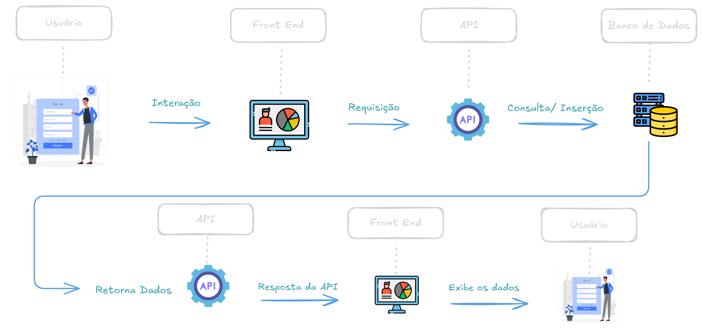

#  📞 **Sistema de Atendimento - Call System**

## **Introdução**

🌟 O call system é uma aplicação web desenvolvida para o registro e consulta de atendimentos realizados por uma empresa de telecomunicações. O sistema permite que atendentes de telemarketing registrem problemas relatados pelos clientes e consultem as reclamações já cadastradas.

#

## ✍🏽**Diagrama do Sistema**

#

## 📌 **Visão Geral do Projeto**
Este projeto é composto por:

  1️⃣ **`Back End:`** Desenvolvimento de uma API *Flask*, que gerencia os atendimentos e interage com o banco de dados.

  2️⃣ **`Front End:`** Interface web dinâmica desenvolvida com HTML, CSS e JavaScript.

#

## 🚀 **Tecnologias Utilizadas**

  ✅ **`Python`**

  ✅ **`SQLite (Banco de Dados Relacional)`**

  ✅ **`HTML, CSS E JavaScript`**

  ✅ **`Postman (Teste de API)`**

# 

## 📊 Funcionalidades

* **`Registro de Atendimentos com ID da Call, CPF do Cliente, Tipo de Problema e Descrição.`**

* **`Consultar atendimento já registrados`** 

* **`Validação de entrada para evitar erros de dados`** 

* **`Interface interativa e responsiva com mensagens dinâmicas`** 

* **`Utilização de um Banco de Dados para armazenamento das informações`** 

#

## 🌐 Rotas da API

| Método | Rota | Descrição
|-----------------|--------------| --------------|
| POST| /registrar_atendimentos | Registra um novo atendimento
| GET | /listar_atendimentos | 	Lista todos os atendimentos
